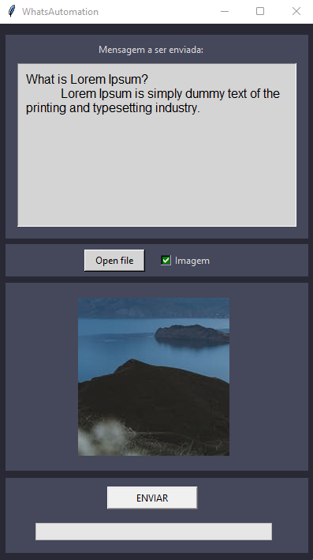

<h1  align="center"> WhatsAutomation </h1>
<h4 align="center">Sistema de envio de mensagens automáticas</h4>

  	
  
	
  
  
  
  
   

  <a href="#-project">Project</a>&nbsp;&nbsp;&nbsp;|&nbsp;&nbsp;&nbsp;
  <a href="#-Versions">Versions</a>&nbsp;&nbsp;&nbsp;|&nbsp;&nbsp;&nbsp;
  <a href="#-How-To-Use">How To Use</a>&nbsp;&nbsp;&nbsp;|&nbsp;&nbsp;&nbsp;
  <a href="#memo-license">License</a>

## 💻 Project

WhatsAutomation é uma aplicação para envio de mensagens e imagens automática a partir de uma planilha de contato

<h1 align="center">
    
</h1>

## 📁 Versions
  - Versão: [v0.1](https://github.com/EliasJuk/WhatsAutomation/tree/main/versions/v0.1)
    - Envio de Mensagens de texto e imagem unica
    - Envio de mensagem com base em planilha de contatos
    - Suporte ao Google Chrome

---
## :memo: License

This project is under the MIT license. See the [LICENSE](LICENSE.md) for details.