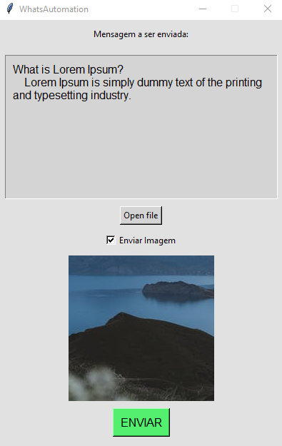

<h1  align="center"> WhatsAutomation </h1>
<h4 align="center">Sistema de envio de mensagens automáticas</h4>

WhatsAutomation é uma aplicação para envio de mensagens e imagens automática a partir de uma planilha de contato

&nbsp;

<h1 align="center">
    
</h1>